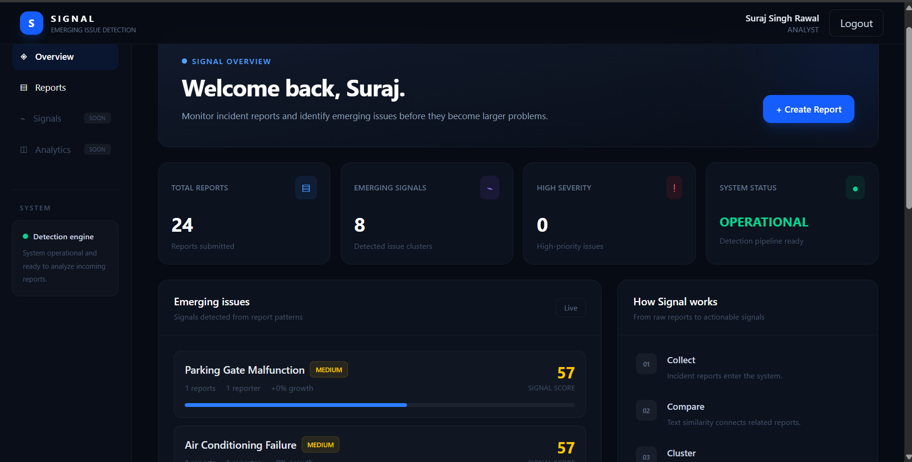
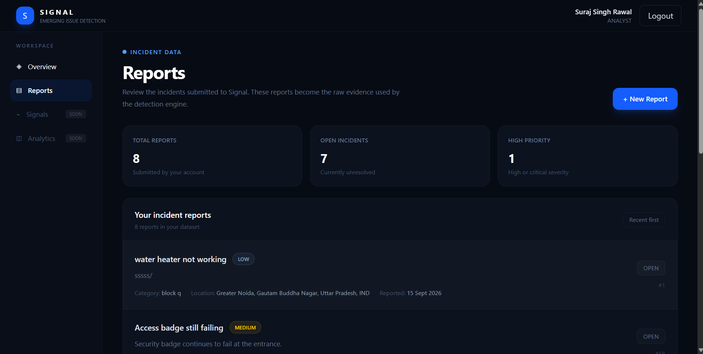
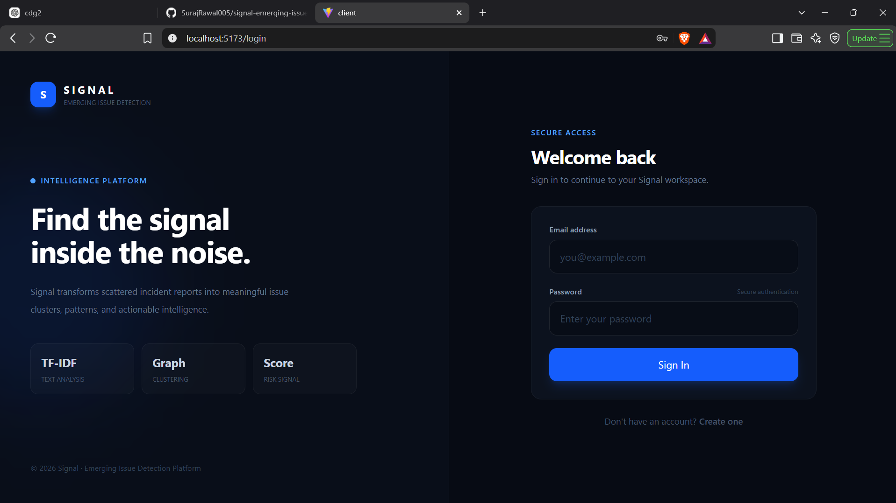
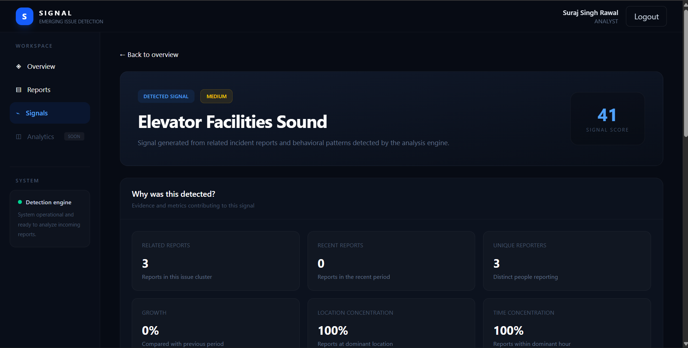

# Signal — Emerging Issue Detection Platform

> Turn scattered incident reports into actionable signals.

Signal is a full-stack platform that analyzes incident reports to detect emerging issues using text similarity, graph-based clustering, statistical analysis, and explainable risk scoring.

Instead of treating every report independently, Signal identifies related reports, measures how their frequency and patterns change over time, and produces an evidence-backed signal score.

---

## Overview

Organizations often receive large numbers of incident reports that are difficult to analyze manually.

A single report may not appear important.

Several related reports appearing across different users, locations, and time periods can reveal an emerging issue.

Signal automates this process:

```text
Incident Reports

       ↓

Text Preprocessing

       ↓

TF-IDF

       ↓

Cosine Similarity

       ↓

Similarity Graph

       ↓

Connected Components

       ↓

Statistical Analysis

       ↓

Signal Scoring

       ↓

Severity Classification

       ↓

Evidence & Explanation

       ↓

Dashboard
```

## Key Features

🔎 Emerging Issue Detection

Automatically groups related incident reports into issue clusters using:

TF-IDF

Cosine similarity

Similarity graphs

Connected-component clustering

📊 Statistical Analysis

Each detected cluster is evaluated using:

Frequency

Recent growth

Historical baseline

Z-score

Reporter diversity

Time concentration

Location concentration

🎯 Weighted Signal Scoring

Signals are generated using a weighted scoring model:

| Metric | Weight |
|---|---:|
| Frequency | 20% |
| Growth | 25% |
| Historical baseline | 20% |
| Reporter diversity | 15% |
| Time concentration | 10% |
| Location concentration | 10% |

The resulting score is converted into:

LOW

MEDIUM

HIGH

CRITICAL

🧠 Explainable Detection

Signal does not simply produce a score.

It provides evidence explaining why an issue was detected, including:

Related reports

Growth compared with previous activity

Number of unique reporters

Time concentration

Location concentration

Historical baseline

Contributing metrics

🔐 Authentication & Authorization

The backend includes:

JWT authentication

bcrypt password hashing

Role-based access control

ADMIN

ANALYST

REPORTER

🧪 Testing

The backend includes automated tests using:

Jest

Supertest

The detection engine is tested for:

Tokenization

TF calculation

IDF calculation

TF-IDF

Cosine similarity

Similarity graph construction

Connected components

Cluster analysis

API authentication behavior

## Architecture

```text
                         SIGNAL

                           │

                           ▼

                    ┌─────────────┐
                    │    React    │
                    │    Vite     │
                    │  Tailwind   │
                    └──────┬──────┘

                           │ REST API

                           ▼

                    ┌─────────────┐
                    │   Express   │
                    │   Node.js   │
                    └──────┬──────┘

                           │

              ┌────────────┼────────────┐
              ▼            ▼            ▼

        Authentication  Reports    Detection

              │            │            │

              │            │            ├─ TF-IDF
              │            │            ├─ Cosine Similarity
              │            │            ├─ Graph Clustering
              │            │            ├─ Frequency Analysis
              │            │            ├─ Growth Analysis
              │            │            ├─ Z-Score
              │            │            └─ Risk Scoring

              │            │

              └────────────┼────────────┘

                           ▼

                         MySQL
```

## Technology Stack

Frontend

React

Vite

Tailwind CSS

React Router

Axios

Backend

Node.js

Express.js

JWT

bcrypt

CORS

Database

MySQL

Algorithms

TF-IDF

Cosine Similarity

Graph-based clustering

Connected Components

Frequency Analysis

Growth Analysis

Z-Score

Weighted Risk Scoring

Testing

Jest

Supertest

## Detection Pipeline

1. Text Preprocessing

Report title, description, and category are combined and normalized.

Stop words and punctuation are removed before analysis.

2. TF-IDF

TF-IDF represents reports numerically based on the importance of their terms across the report collection.

3. Cosine Similarity

Reports are compared using cosine similarity to determine how closely their content is related.

4. Similarity Graph

Reports become graph nodes.

A similarity above the configured threshold creates an edge between two reports.

5. Connected Components

Connected components transform the similarity graph into groups of related reports.

Each group represents a potential issue cluster.

6. Statistical Analysis

Clusters are evaluated against recent and historical activity.

7. Signal Score

Multiple metrics are normalized and combined using the weighted scoring model.

8. Explanation

The system exposes the evidence behind the score so users can understand why a signal was generated.

## Example Signal

A cluster such as:

Corridor Water Facilities

may contain several related reports occurring within a short period.

Signal evaluates:

Reports              → 4

Unique reporters     → 2

Recent growth        → +200%

Signal score         → 75.5

Severity             → HIGH

Instead of simply displaying:

HIGH

Signal provides the underlying evidence that contributed to the classification.

## Screenshots

### Dashboard



### Signal reports



### Authentication



### Signal analysis



## Project Structure

```text
Signal/
│
├── client/
│   └── src/
│       ├── components/
│       ├── context/
│       ├── pages/
│       ├── services/
│       ├── demoData.js
│       ├── App.jsx
│       └── main.jsx
│
├── server/
│   ├── config/
│   ├── controllers/
│   ├── middleware/
│   ├── routes/
│   ├── services/
│   ├── tests/
│   ├── app.js
│   └── server.js
│
└── README.md
```

## API Overview

Authentication

```text
POST /api/auth/register
POST /api/auth/login
GET  /api/auth/me
```

Reports

```text
POST   /api/reports
GET    /api/reports
GET    /api/reports/mine
GET    /api/reports/:id
PUT    /api/reports/:id
DELETE /api/reports/:id
```

Detection

```text
GET /api/reports/analyze
```

## Testing

Run the backend tests:

```bash
cd server
npm test
```

The current test suite covers the core detection algorithms and API authentication behavior.

## Running Locally

Backend

```bash
cd server
npm install
npm run dev
```

Frontend

```bash
cd client
npm install
npm run dev
```

The frontend runs on:

[http://localhost:5173](http://localhost:5173)

The backend runs on:

[http://localhost:5000](http://localhost:5000)

## Why I Built Signal

Signal was designed to demonstrate practical software engineering beyond CRUD applications.

The project combines:

Full-stack development

REST API design

Authentication

RBAC

SQL database design

Data structures and algorithms

Statistical analysis

Graph algorithms

Automated testing

Explainable decision systems

The goal was to build a system where the reasoning behind a detected issue is visible rather than hidden behind a black-box model.

## Project Status

Signal V1.0 — Feature Complete

The initial version is frozen.

Future improvements may include:

Advanced analytics

Advanced signal section

Additional detection strategies

Production infrastructure improvements

More sophisticated visualization

Larger-scale performance optimization

## Author

**Suraj Singh Rawal**